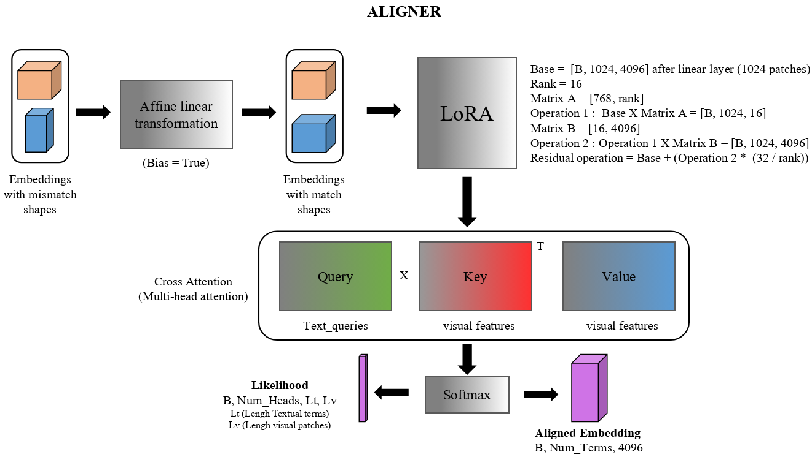
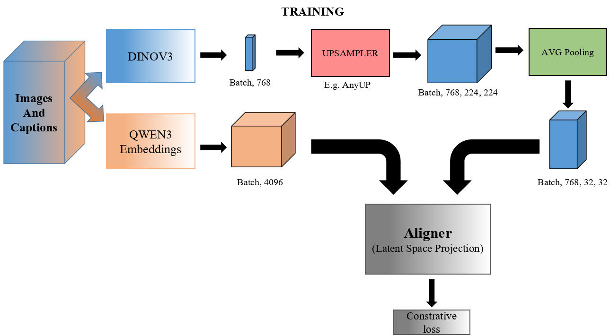
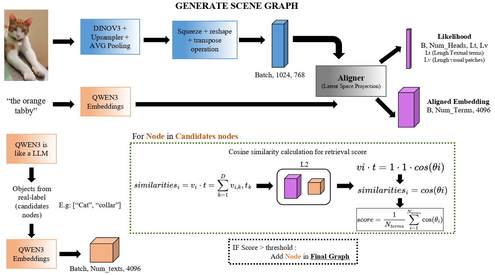
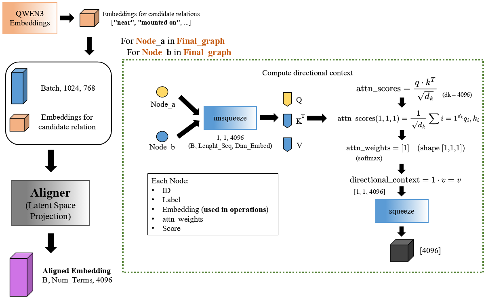
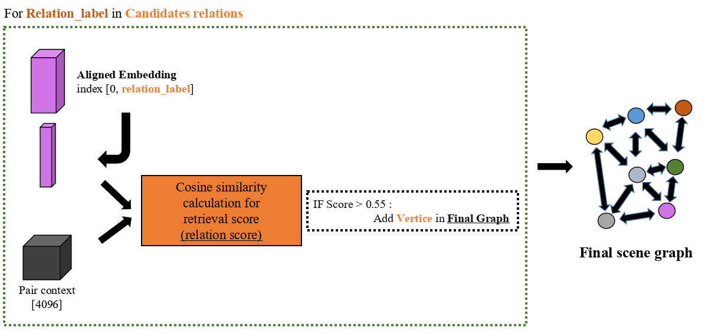

# SceneEmbed-Up

**Alinhamento Multimodal de Alta Resolução para Geração de Scene Graphs**

Pipeline de pesquisa que combina **DINOv3** (encoder visual com upsampling HR) + **Qwen3-Embedding-8B** (encoder textual) + **LoRA Cross-Attention Aligner** para aprender um espaço de embeddings compartilhado e gerar Scene Graphs semânticos enriquecidos com Knowledge Graphs.

- **Scene Graph Generation** on Visual Genome (VG-150) via 3 independent stages: DETR-R50 detector (fine-tuned), supervised `AttributeHead` and directional `RelationHead` — all operating over frozen high-resolution DINOv3 features projected to Qwen3 text space via `aligner.visual_proj`.

- **Contrastive Alignment** via LoRA cross-attention bridge between frozen high-resolution vision (DINOv3 + AnyUp) and language (Qwen3-8B) foundation models, with LLM-driven knowledge graph expansion.
---

## Visão Geral da Arquitetura

```
Imagem
  └─► DinoSceneEncoder (ViT-B/16 + AnyUp)
        ├─ CLS token    [1, 768]              ← representação global
        └─ HR patches   [B, 768, H_orig, W_orig]
              │
              │  adaptive_avg_pool2d(32×32)
              ▼
          [B, 768, 32, 32]
              │
              │  reshape + transpose (flatten)
              ▼
          [B, 1024, 768]  ──────────────────┐
              │                              │
              ▼                              ▼
  LoRACrossAttentionAligner         SGClassifierHead (VG-150)
    visual_proj (frozen) + LoRA       LayerNorm + MLP
    CrossAttention: Q=text, K=V=vis   patch_logits [B, 1024, 150]
              │                              │
              │ (usado apenas em retrieval   │  sigmoid + threshold
              │  — Recall@K com shards H5)   │  + connected components (4-conn)
              │                              │  + MIL mean-pool por componente
              │                              ▼
              │                      Instâncias de objetos
              │                      (mask 32×32, feat [768])
              │                              │
              │   aligner.visual_proj (frozen) [768 → 4096]
              │                              │
              │                              ▼
              │                       node_embs [N_obj, 4096]
              │                              │
              │                              ▼
              │                     RelationHead (VG-50)
              │                     sub / obj / (s−o) / ctx
              │                     MLP → pred_logits
              │                              │
              │                              ▼
              │                      Arestas direcionadas
              │                      (sub, pred, obj, conf)
              │                              │
              │                              ▼
              │                     ┌────────────────────┐
              │                     │ SceneGraphGenerator │
              │                     │   nodes + edges    │
              │                     └─────────┬──────────┘
              │                               ▼
              │                       Knowledge Graph
              │                       (tripletas is_a via Qwen3 LLM)
              ▼
   attn_output [B, N_q, 4096]
   (retrieval — eval_retrieval_*)
```

**Fluxo de treino em dois estágios:**

1. **Aligner** — treinado em COYO-700M via shards H5 com InfoNCE simétrico + `entropy_reg` ([train_aligner_with_h5.py](train_aligner_with_h5.py)).
2. **Heads VG-150** — com Aligner e DINO congelados:
   - [train_sg_head.py](train_sg_head.py): `SGClassifierHead` sobre `[B, 1024, 768]` do DINO, multi-label BCE com `pos_weight`.
   - [train_relation_head.py](train_relation_head.py): `RelationHead` sobre pares GT projetados via `aligner.visual_proj` (setup PredCls-like, bboxes GT), CE com `class_weight`.







---

## Funcionalidades

- **Encoder visual de alta resolução:** DINOv3 ViT-B/16 com upsampling por [AnyUp](https://github.com/wimmerth/anyup) ou FeatUp (JBU Stack), preservando detalhes espaciais finos.
- **Encoder textual de alta capacidade:** Qwen3-Embedding-8B com mean pooling e instrução de tarefa contextual.
- **Aligner com LoRA:** Projeção visual congelada + adaptadores LoRA treináveis (rank=64, ~200K params), cross-attention assimétrico texto→visual.
- **SGClassifierHead (VG-150):** MLP leve sobre a grade HR 32×32 do DINO (`[B, 1024, 768]`) para classificação multi-label de objetos em VG-150, com agregação MIL/connected-components.
- **RelationHead (VG-50):** Classificador de predicados direcional sobre pares `(sub, obj)` já projetados no espaço Qwen (4096-d) via `aligner.visual_proj`, com feature de diferença e contexto cross-attention opcional. Setup PredCls-like (bboxes GT no treino).
- **Scene Graph generativo:** Detecção de objetos por thresholding de similaridade + inferência de relações direcionais via cross-attention entre nós; integrável com `SGClassifierHead`/`RelationHead`.
- **Knowledge Graph expansivo:** Extração de fatos taxonômicos (`is_a`) via prompting estruturado do Qwen3.
- **Pipeline de dados COYO-700M + Visual Genome:** Shards HDF5 em buffer rotativo para retrieval (COYO) e loaders multi-label/pares GT para Scene Graph Generation (VG-150).
- **Métricas completas:** Recall@K bidirecional (I2T + T2I), SGGen R@20/50/100 e mean Recall@K (mR@K) no padrão da literatura de SGG, semantic coverage, entity recall, expansion ratio, mean hypernym count.

---

## Estrutura do Projeto

```
SceneEmbed-Up/
├── models/
│   ├── encoders/
│   │   ├── dinov3_extrator.py       # DinoSceneEncoder
│   │   └── qwen3_extrator.py        # QwenSceneEmbedder
│   ├── aligners/
│   │   └── lora_cross_attention.py  # LoRACrossAttentionAligner
│   ├── ups/
│   │   └── hr_conversions.py        # AnyUpModel, JBUStack, LoftUpModel
│   └── SG/
│       ├── generation.py            # SceneGraphGenerator, KnowledgeGraphGenerator
│       ├── classifier_head.py       # SGClassifierHead (VG-150), RelationHead (VG-50)
│       └── projection.py            # Helpers de projeção/score (reexports)
├── data/
│   ├── data_utils_pytorch.py        # Datasets e DataLoaders (COYO/shards H5)
│   ├── vg_dataset.py                # Visual Genome: multi-label + pares GT + VG-150 vocab
│   ├── download_visual_genome.py    # Download de imagens/anotações do VG
│   ├── extract_files_coyo.py        # Extração dos .tar do img2dataset
│   ├── extract_candidates.py        # Extração de candidatos textuais
│   ├── clearning_texts.py           # Limpeza de legendas COYO
│   ├── get_metadados_coyo.py        # Download de metadados COYO
│   ├── get_small_sample_coyo.py     # Amostra reduzida para debug
│   ├── shards_in_memory_calc.py     # Dimensionamento de buffer em RAM
│   └── analysisCOYO/                # Análises exploratórias de COYO
├── embeddings/
│   └── generate_shards.py           # Exportação de embeddings em shards H5
├── utils/
│   ├── early_stopping.py            # EarlyStopping
│   ├── logging_utils.py             # TensorBoard writer
│   ├── checkpoint.py                # Salvar checkpoints por época
│   ├── graph_io.py                  # Persistência de grafos em JSON
│   ├── graph_viz.py                 # Visualização com networkx
│   ├── io_utils.py                  # Helpers de I/O
│   └── metrics_scene_graph.py       # Métricas de avaliação
├── train_aligner_with_h5.py         # Treino do Aligner com embeddings pré-computados
├── train_aligner_with_Images.py     # Treino fim-a-fim do Aligner com imagens
├── train_sg_head.py                 # Treino da SGClassifierHead sobre VG-150 (DINO congelado)
├── train_relation_head.py           # Treino da RelationHead sobre pares GT de VG-150
├── eval_retrieval_with_h5.py        # Recall@K bidirecional com shards H5
├── eval_retrieval_with_images.py    # Recall@K bidirecional com imagens
├── eval_sg_vg.py                    # SGGen Recall@K (R@K, mR@K) no Visual Genome
├── memory.mdc                       # Contexto rápido para agentes/LLMs
└── Docs/
    └── ARCHITECTURE.md              # Documentação detalhada da arquitetura
```

---

## Instalação

```bash
# Clone o repositório
git clone <repo-url>
cd SceneEmbed-Up

# Instale dependências principais
pip install torch torchvision torchaudio --index-url https://download.pytorch.org/whl/cu121
pip install transformers huggingface_hub
pip install h5py torch_geometric networkx matplotlib tqdm Pillow numpy

# AnyUp (requer natten para atenção local)
pip install natten
# AnyUp é carregado via torch.hub automaticamente na primeira execução

# Token HuggingFace para DINOv3 (modelo restrito)
# Crie tokenDINOV3.json: {"token": "hf_..."}
```

---

## Uso Rápido

### 1. Download e preparação dos dados

```bash
# Baixar metadados COYO
python data/get_metadados_coyo.py

# Download das imagens via img2dataset
img2dataset --url_list F:/COYO/coyo_meta/data \
  --input_format "parquet" --url_col "url" --caption_col "text" \
  --output_format webdataset --output_folder F:/COYO/coyo \
  --processes_count 16 --thread_count 64 --image_size 256 \
  --number_sample 15000000

# Extrair arquivos .tar
python data/extract_files_coyo.py
```

### 2. Gerar embeddings pré-computados

```bash
# Gera shards H5 diretamente (recomendado)
python embeddings/generate_shards.py
```

### 3. Treinar o Aligner (retrieval)

```bash
# Modo rápido (usa embeddings pré-computados) — recomendado
python train_aligner_with_h5.py

# Modo fim-a-fim (requer +24 GB VRAM)
python train_aligner_with_Images.py
```

### 4. Avaliar retrieval

```bash
# Recall@K bidirecional com shards H5
python eval_retrieval_with_h5.py

# Recall@K bidirecional com imagens reais
python eval_retrieval_with_images.py
```

### 5. Scene Graph Generation (Visual Genome VG-150)

```bash
# Baixar Visual Genome (imagens + scene_graphs.json)
python data/download_visual_genome.py --data-dir G:/vg

# Treinar a SGClassifierHead (objetos VG-150) sobre DINO congelado
python train_sg_head.py --vg-dir G:/vg --epochs 20 --batch-size 32

# Treinar a RelationHead (predicados VG-50) sobre pares GT
# Aligner e DINO ficam congelados (setup PredCls-like)
python train_relation_head.py --vg-dir G:/vg --aligner checkpoints/best_aligner.pth

# Benchmark SGGen Recall@K / mean Recall@K
python eval_sg_vg.py --vg-dir G:/vg --checkpoint checkpoints/best_aligner.pth
```

### 6. Visualizar grafos gerados

```bash
python viz/graphs_viz.py
# Gera PNG para cada JSON em results/
```

---

## Formato dos Embeddings (HDF5)

Cada shard `.h5` contém:

| Dataset         | Shape             | Dtype   | Descrição                    |
|-----------------|-------------------|---------|------------------------------|
| `visual_feats`  | `[N, 1024, 768]`  | float16 | Patches 32×32 do DINOv3      |
| `text_feats`    | `[N, 1, 4096]`    | float16 | Embedding Qwen3 da legenda   |
| `visual_global` | `[N, 768]`        | float16 | Token CLS do DINOv3          |

Armazenamento: 7Gb por shard de 5k amostras (compressão gzip).

---

## Função de Loss

```
loss = contrastive_loss + 0.05 × entropy_reg
```

| Componente          | Descrição                                                        |
|---------------------|------------------------------------------------------------------|
| `contrastive_loss`  | InfoNCE simétrico entre visual refinado e texto (τ=0.05)        |
| `entropy_reg`       | `(mean_entropy - 1.5)²` → foca atenção em ~4-5 patches/head    |
| `loss_vg` *(log)*   | InfoNCE sobre média dos patches antes do cross-attention (apenas monitoramento via TensorBoard, não participa do backward) |

---

## Métricas

### Retrieval (Alinhamento)

| Métrica             | Descrição                                          |
|---------------------|----------------------------------------------------|
| `I2T_Recall@K`      | Top-K imagens → encontra o texto correto          |
| `T2I_Recall@K`      | Top-K textos → encontra a imagem correta          |
| `Mean_Recall@K`     | Média bidirecional (padrão CLIP/BLIP)             |

### Scene Graph Generation (VG-150)

| Métrica        | Descrição                                                         |
|----------------|-------------------------------------------------------------------|
| `R@20/50/100`  | Recall@K sobre tripletas `(sub, pred, obj)` (Xu et al. 2017)     |
| `mR@20/50/100` | Mean Recall@K — média por classe de predicado (Tang et al. 2020) |

### Knowledge Graph / Semântica

| Métrica                | Descrição                                         |
|------------------------|---------------------------------------------------|
| `semantic_coverage`    | Cobertura das entidades visuais pelo KG           |
| `entity_recall`        | Recall das entidades KG no SG                     |
| `expansion_ratio`      | Entidades KG / nós SG                            |
| `mean_hypernym_count`  | Média de relações `is_a` por objeto              |
| `structural_density`   | Densidade de arestas no SG                        |

---
                    

## Logs e Checkpoints

```
logs/
  ├── YYYYMMDD-HHMMSS/   ← TensorBoard do Aligner (loss, acc, entropy)
  └── sg_head/           ← TensorBoard das heads de SG/Relation

checkpoints/
  ├── best_aligner.pth   ← Melhor Aligner (EarlyStopping)
  ├── aligner_epoch_N.pth
  ├── best_sg_head.pth   ← Melhor SGClassifierHead
  └── best_relation_head.pth

results/
  ├── resultado_batch0_img0.json
  ├── resultado_batch0_img0.png  ← grafo visualizado
  ├── recall_metrics.json
  └── sgg_vg_metrics.json        ← R@K / mR@K do eval_sg_vg.py
```

Visualizar logs:
```bash
tensorboard --logdir logs/
```

---

## Documentação

- [`Docs/ARCHITECTURE.md`](Docs/ARCHITECTURE.md) — Arquitetura completa e detalhada
- [`memory.mdc`](memory.mdc) — Referência rápida para agentes/LLMs

---

## Referências

- [DINOv3](https://github.com/facebookresearch/dinov3) — Meta AI
- [Qwen3](https://huggingface.co/Qwen/Qwen3-Embedding-8B) — Alibaba Cloud
- [AnyUp](https://github.com/wimmerth/anyup) — Wimmer et al.
- [FeatUp](https://github.com/mhamilton723/FeatUp) — Hamilton et al.
- [COYO-700M](https://github.com/kakaobrain/coyo-dataset) — Kakao Brain
- [Visual Genome](https://homes.cs.washington.edu/~ranjay/visualgenome/) — Krishna et al.
- [img2dataset](https://github.com/rom1504/img2dataset) — Beaumont
- Xu et al., *Scene Graph Generation by Iterative Message Passing*, CVPR 2017
- Zellers et al., *Neural Motifs*, CVPR 2018
- Tang et al., *Unbiased Scene Graph Generation from Biased Training*, CVPR 2020

---

## Convenções do Código

- **Shapes documentados** em todas as funções com `[B, C, H, W]`
- **`@torch.no_grad()`** em métodos de inferência
- **`bfloat16`** para operações GPU e armazenamento H5
- **Context managers** obrigatórios para H5PY
- **`tqdm`** em todos os loops de processamento de dados
- Erros de GPU → `torch.cuda.memory_summary()` antes de raise
